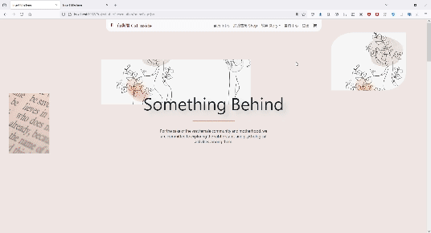
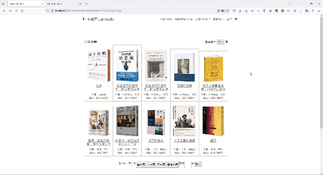
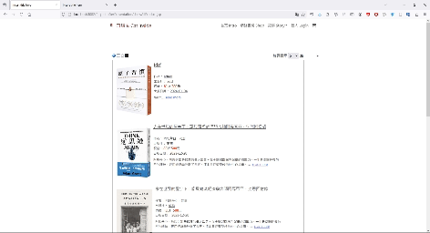
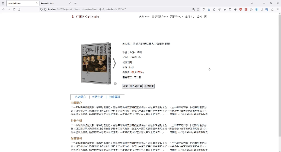
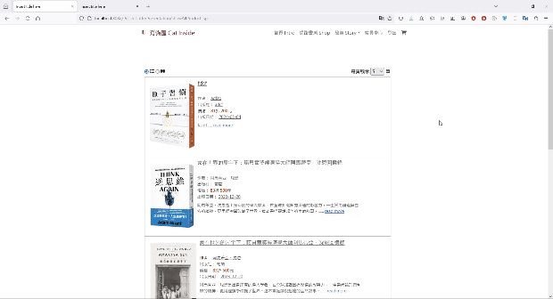
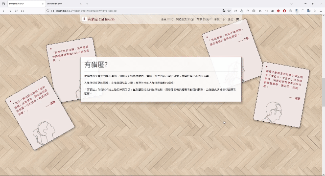

# 網路書店

職訓課程的專案，還有不少功能尚待加強。

## 簡介

包含會員系統、購物車的網路書店，提供多樣化的瀏覽界面，並有專欄文章的空間。

## 功能

- 首頁
    
    上課期間練習作品，使用skrollr來創造下拉時的動畫效果

  
   
    
- 網路書店
    
    透過vue置換css的class，呈現不同的商品呈現方式。透過ajax達成換頁時，非同步更新頁面商品。

    
- 商品細節

  
- 註冊帳號
    
    註冊後即自動登入

    
- 購物車及結帳

  
- 會員中心/歷史訂單

  
- 文章頁面

  

- 商品管理後台（尚待完善）
  僅有簡易新增商品、上架與否、商品一覽的功能
